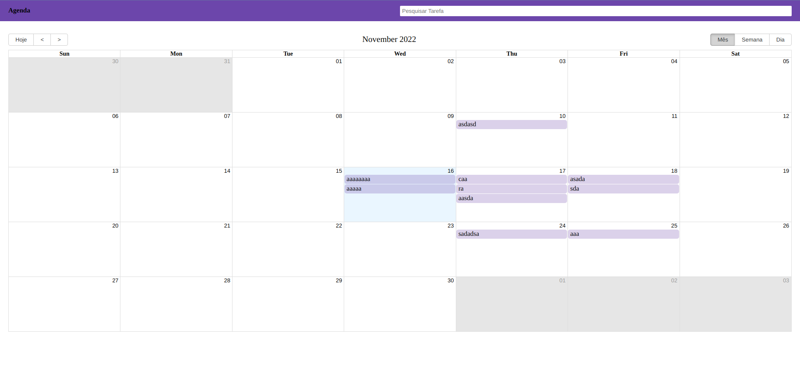

# Calendar-front

Bibliotecas utilizadas: 
- React Tostify
- React Big Calendar
- Axios para requisiçoes.

###Calendario visualizaçao pelo mes: 

###Calendario visualizaçao pela semana: 

###Calendario visualizaçao pelo dia: 

É possivel selecionar área para poder adicionar um novo evento.
Pesquisa de tarefa não finalizada :(
